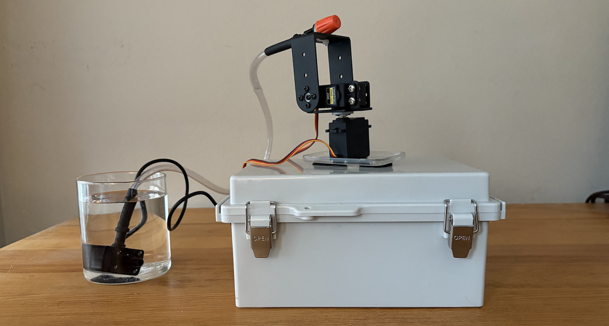
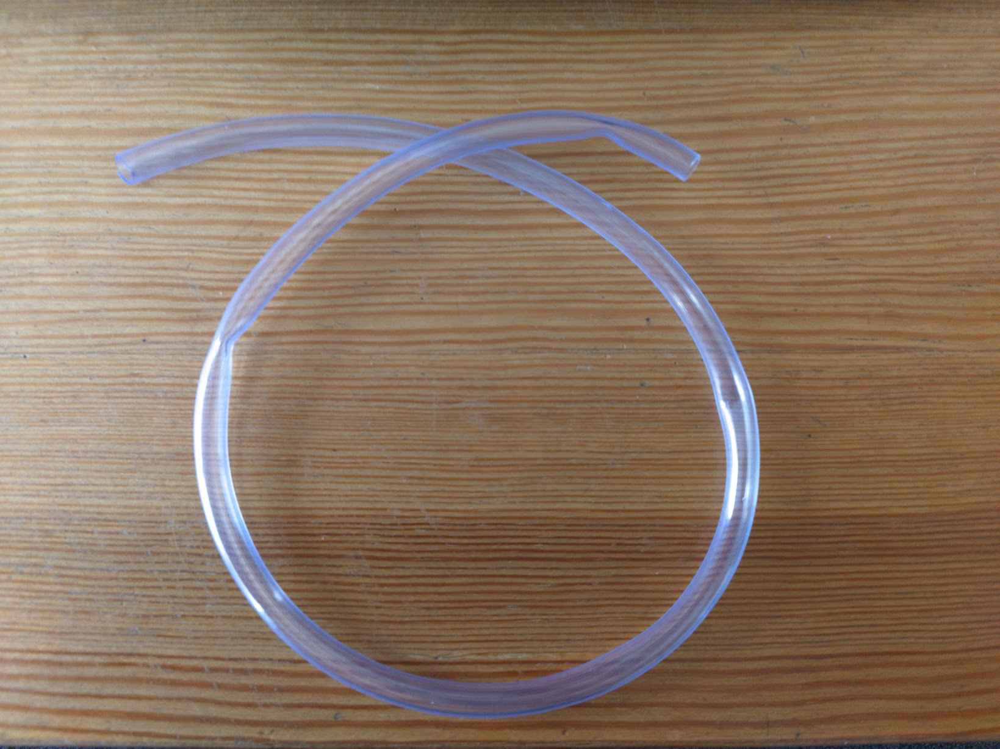
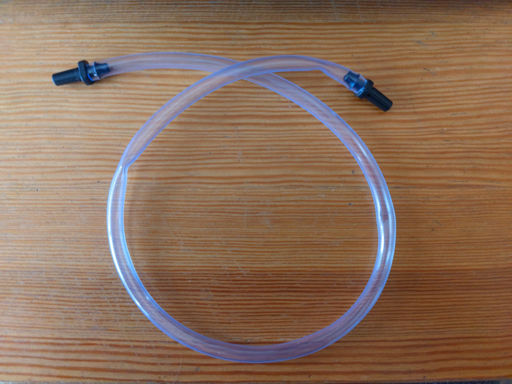
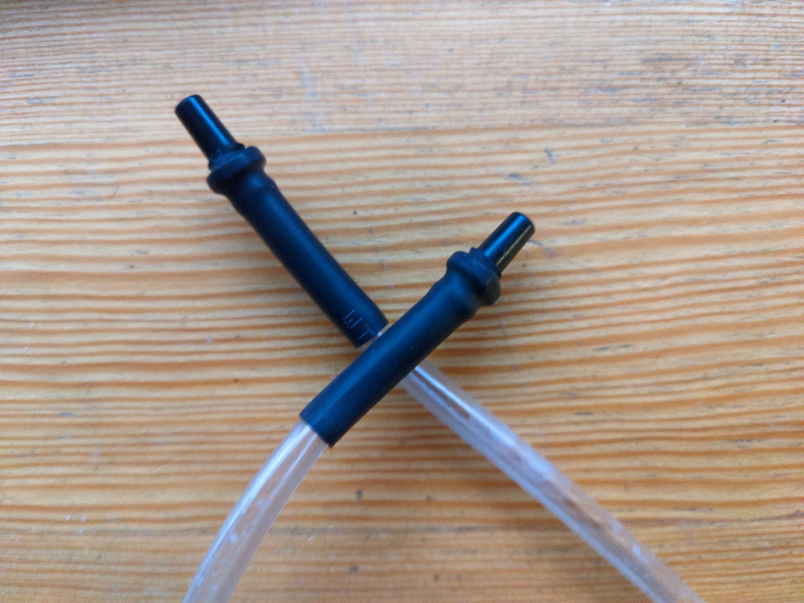
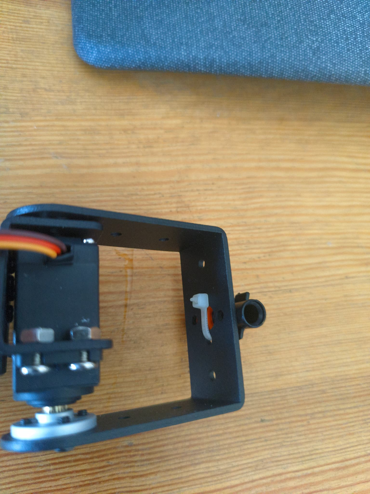
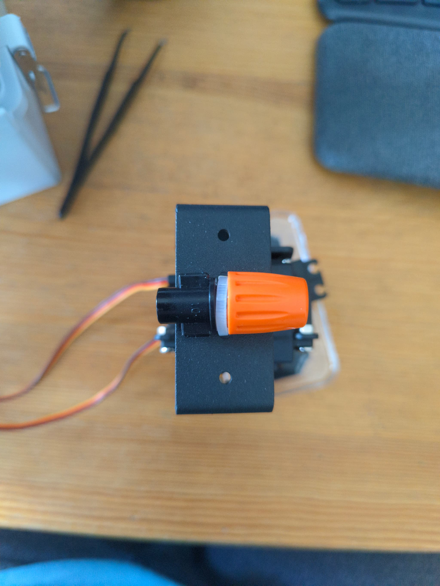
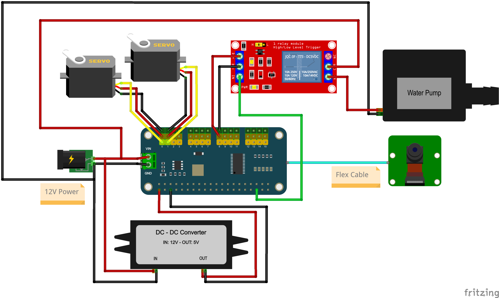
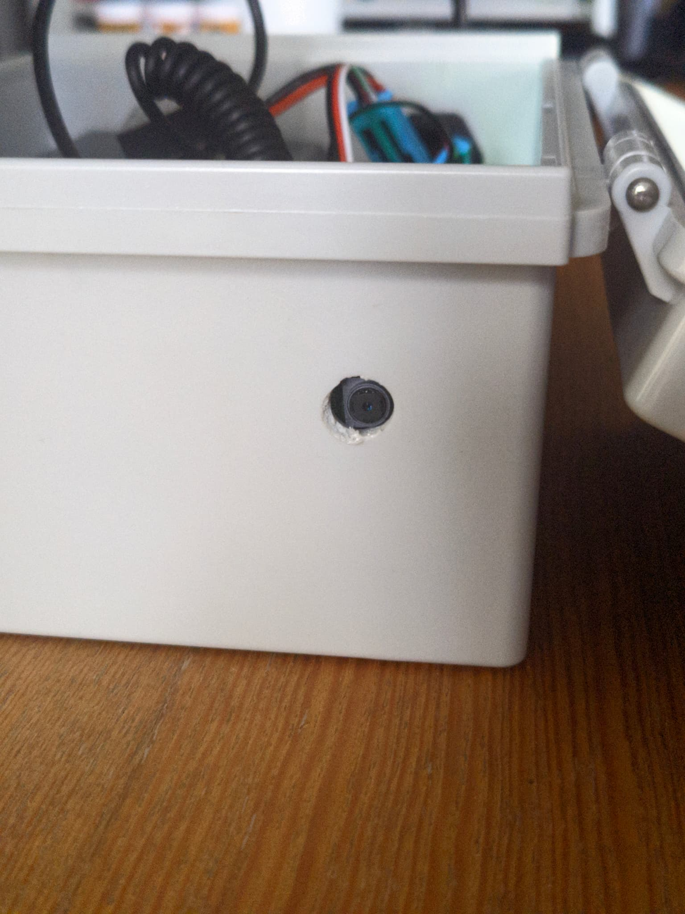
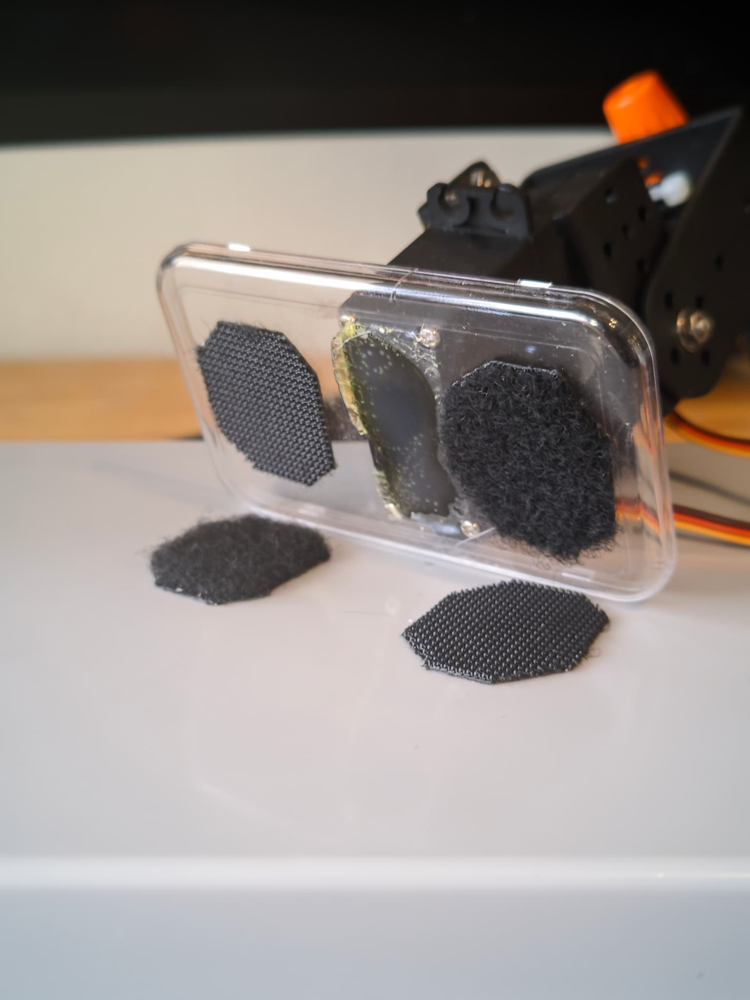

# Bird Sentry

When I started working remotely during the pandemic, I expected fewer distractions and a quiet space to focus.
Instead, my balcony became a gathering spot for pigeons. Their nonstop cooing interrupted my meetings, broke my focus, and tested my patience.
Fed up, I tried spraying them with a water bottle. It worked, but they came right back, almost daring me to try again.
So, I did what any engineer with a grudge and too much free time in lockdown would do: I built a robot to handle my pigeon problem.
To my surprise, it worked! I finally got some peace and quiet.

## Introduction

Bird Sentry is a robot that scares off birds by spraying them with water.
It uses a Raspberry Pi Zero 2 W to control a servo pan-tilt and aim the water from a pump.
It includes a camera for detecting birds in real time, and you can control it remotely using the built-in WIFI.
I had a lot of fun building the first version, so after a couple years I decided to do a second version with some improvements.
These are the instructions for the second version.

## Components

- Raspberry Pi Zero 2 W
- Raspberry Pi Camera Module with Flex Cable
- [WaveShare PWM Servo HAT](https://www.waveshare.com/servo-driver-hat.htm)
- [Pan-Tilt Servo Mount](https://www.amazon.ca/gp/product/B07PQ12TXS)
- [MG996R Servo Motors](https://www.amazon.ca/gp/product/B07PQ12TXS) (May come with pan-tilt kit)
- Vinyl Tubing
- [Irrigation Spray Nozzle](https://www.amazon.ca/gp/product/B0CGLZG53L)
- [12v Micro Brushless Water Pump](https://www.amazon.ca/gp/product/B071RF314K)
- [12v Relay Module](https://www.amazon.ca/gp/product/B07WQH63FB)
- [DC-DC Buck Converter 12v to 5v 3a](https://www.amazon.ca/gp/product/B0B2RF1L92)
- [12v Power Supply](https://www.amazon.ca/gp/product/B01GEA8PQA) or [12v Rechargeable Battery](https://www.amazon.ca/gp/product/B07YRZYLKV)
- [Female Barrel Connector](https://www.amazon.ca/gp/product/B01J1WZENK)
- Jumper Wires
- Heat Shrink Tubing
- Zip Ties
- Weatherproof Enclosure

## Pan-Tilt Servo Mount

The pan-tilt servo mount comes with two MG996R servo motors and a set of screws, gears and bearings. I didn't find an official documentation page from the seller, but the Amazon post comes with a helpful video showing all the steps required for the assembly. Here is a link in case you can't find it:

[Pan-Tilt Assembly Video](/elechawk-pan-tilt-assembly.mp4)

## Water Firing Mechanism

1. Cut a piece of vinyl tubing to the desired length and attach male couplers to both ends of the tubing.

{data-zoomable .thumb}
{data-zoomable .thumb}

2. Use heat shrink tubing and heat gun to secure the couplers in place. This should prevent the couplers from coming off when the water pressure increases.

{data-zoomable .thumb}
{data-zoomable .thumb}

3. Secure the nozzle to the servo pan-tilt using zip ties. I found best to route the zip tie over the screw section of the nozzle and tighten the orange cap to secure it in place, otherwise the nozzle might wiggle when the servos move.

{data-zoomable .thumb}
{data-zoomable .thumb}

4. Now we can attach the vinyl tubing from the water pump to the nozzle. The couplers should fit snuggly into the pump and nozzle, but you can use more heat shrink tubing to secure them in place if needed.

## Wiring Diagram

This diagram shows how I wired all the components to the Raspberry Pi Zero 2 W and the WaveShare PWM Servo HAT. For simplicity, I don't show the Raspberry PI, because it only connects to the WaveShare PWM Servo HAT using the GPIO pins and the camera using the flex cable.

> [!CAUTION]
> The servos I selected can have high power spikes which cause the Raspberry PI to reboot. I fixed this by powering the Raspberry PI with an external DC-DC Buck Converter.
Before using the external DC-DC Buck Converter you **MUST** first remove the 0R resistor from the WaveShare PWM Servo HAT. You can find the full explanation in the [WaveShare Wiki](https://www.waveshare.com/wiki/Servo_Driver_HAT).

{data-zoomable}

## Enclosure

Because the Bird Sentry robot operates on my balcony, I bought a weatherproof enclosure to protect the electronics from the elements.
I opted for an off-the-shelf junction box, which included a couple of cable glands.
I used a gland to route the cables from the water pump and the servos, keeping all the control electronics inside the enclosure.
I also drilled a hole in the enclosure to allow the camera to see outside. I haven't found a good way to seal the hole yet, so for now, I'm using a packet of silica gel to absorb the moisture that gets in.
I placed the pan-tilt on top of the enclosure to utilize the height and stabilize it with the weight of the components. To make it removable for maintenance, I glued the motors to a small plastic plate and attached the plate to the enclosure with velcro.

{data-zoomable .thumb}
{data-zoomable .thumb}
{data-zoomable .thumb}
{data-zoomable .thumb}
{data-zoomable .thumb}

## Final Result

<video controls width="500px" style="margin:auto">
  <source src="/bird-sentry.mp4" type="video/mp4">
</video>
